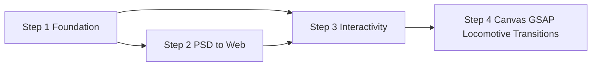

# Anemoia – Point-and-Click Web Installation MVP

## Current state

- **Stack**: Astro 5.x, minimal dependencies. Existing demo: [src/pages/index.astro](src/pages/index.astro) with [Scene.astro](src/components/Scene.astro) (background/foreground parallax via `data-parallax` and mouse movement).
- **Gap**: No content collections, no overworld/neighborhood/story routes, no shared conventions or asset strategy. Image paths in components point to `/src/assets/` (invalid at runtime; Astro expects imports or `public/`).

---

## Step 1: Foundation (structure, conventions, views, assets)

### 1.1 Project structure (modular and scalable)

```
src/
  components/       # Reusable UI (buttons, overlays, etc.)
  layouts/          # Layout.astro, GameLayout.astro (full-viewport, no chrome)
  pages/            # Views = routes
  scenes/           # Scene compositions (layer stacks + optional canvas)
  content/          # Content collections (see below)
  data/             # JSON config (overworld map zones, layer manifests)
  styles/           # Global SCSS, BEM, variables
  scripts/          # Shared client scripts (parallax, router init)
  assets/           # Images/video/audio that need optimization (import in Astro)
public/             # Static assets (favicon, large videos if not processed)
```

**Views (pages)**:

- `index.astro` – Splash / menu.
- `overworld.astro` – 2D map; clickable neighborhoods (single page, no dynamic segment).
- `neighborhood/[id].astro` – One neighborhood “skyline” (e.g. `limoilou`, `vieux-quebec`).
- `story/[slug].astro` – Short story + voiceover (content collection entry by slug).

### 1.2 Naming and conventions

- **Files**: `kebab-case` (e.g. `neighborhood-view.astro`, `layer-stack.astro`).
- **Components**: PascalCase (e.g. `LayerStack.astro`, `InteractiveZone.astro`).
- **JS/TS**: camelCase; constants UPPER_SNAKE; type/interface PascalCase. Prefer TypeScript for `scripts/` and inline `<script>` where it helps.
- **CSS**: BEM + SCSS under `src/styles/`. One main entry (e.g. `global.scss`) imported in [Layout.astro](src/layouts/Layout.astro). Block = component or view name (e.g. `.scene`, `.scene__layer`, `.scene__layer--foreground`).

### 1.3 Layouts and “views” vs “scenes”

- **Layout**: Base HTML, meta, global styles. Optional `GameLayout.astro` that sets full-viewport, no scroll (for overworld and neighborhood). Story view uses a layout that allows scroll (for Locomotive).
- **View** = one Astro page (index, overworld, neighborhood, story).
- **Scene** = the visual composition on that page: a stack of layers (images/video) + optional canvas overlay. Reusable component that accepts a “scene descriptor” (layers + optional shader config).

### 1.4 Assets

- **Images used in components**: Put in `src/assets/`. Import in Astro and use `<Image />` or the image helper so Astro can optimize (responsive, format).
- **Large or non-optimized**: `public/` (e.g. some video loops). Reference by path `/videos/...`.
- **Per-neighborhood assets**: e.g. `src/assets/neighborhoods/limoilou/` (layers, hot-spot images). Optionally reference from a layer manifest (Step 2).
- **Audio**: `src/assets/audio/` or `public/audio/`; use `<audio>` or a small player component; consider preload and autoplay policy for installation.
- **Content collection images**: Use the schema `image()` helper for story covers or in-story media; keep paths relative to the collection or under `src/assets/`.
- **3D models**: If needed later, keep in `public/` or a dedicated folder; load with three.js or similar; out of scope for MVP unless you confirm.

**Deliverables**: Restructure repo to the tree above; add `src/styles/global.scss` and BEM examples in existing components; fix asset paths (use imports or correct `public/` paths); add placeholder pages for overworld and `neighborhood/[id]` and `story/[slug]`; document conventions in a short README or CONTRIBUTING.

---

## Step 2: PSD layer positions into the web (no hardcoded pixels)

### 2.1 Exporting layer data from Photoshop

- **Preferred**: Photoshop script (ExtendScript, `.jsx`) that walks the document and writes a JSON file. For each (visible) layer or group, export at least: `name`, `bounds` (left, top, right, bottom in pixels), `index` or order (for z-index), `opacity`, and optionally `visibility`. Document size (width/height) so the web can scale.
- **Reference**: Scripts use `layer.bounds` (e.g. `bounds[0]` = left, `bounds[1]` = top, `bounds[2]` = right, `bounds[3]` = bottom). Set document units to pixels before export. Existing community scripts (e.g. “Export Layer Coordinates”) can be adapted to output JSON.
- **Alternative**: Third-party tools (e.g. Export Kit) that export PSD to JSON; validate that they output position/size and layer order.

### 2.2 JSON schema (layer manifest)

One manifest per “scene” (e.g. one per neighborhood or per overworld). Example shape:

```json
{
	"documentWidth": 1920,
	"documentHeight": 1080,
	"layers": [
		{"id": "sky", "name": "Sky", "bounds": [0, 0, 1920, 400], "zIndex": 0, "opacity": 1, "src": "sky.png"},
		{"id": "building-a", "name": "Building A", "bounds": [100, 200, 500, 900], "zIndex": 1, "opacity": 1, "src": "building-a.png"}
	]
}
```

- `src` can be a path relative to a base (e.g. `src/assets/neighborhoods/limoilou/`). Optional: `video` instead of `src` for video layers; optional `interactive: true` and `hotspots` array for Step 3.

### 2.3 Web component that consumes the manifest

- **Container**: One wrapper (e.g. `.scene` or `.layer-stack`) with `aspect-ratio` or fixed dimensions derived from `documentWidth`/`documentHeight`, and `position: relative`. Use a CSS custom property or inline style so the container scales (e.g. `max-width: 100vw`, `max-height: 100vh`, object-fit behavior).
- **Layers**: Each layer is an absolutely positioned child. Position/size from bounds: convert to `left`, `top`, `width`, `height` in **percent** of the document size so the layout is responsive without hardcoded pixels (e.g. `left: (bounds[0]/documentWidth)*100%`).
- **Z-index**: Use the exported index or a `zIndex` field so the stacking order matches Photoshop.
- **Assets**: In Astro, resolve `src` to an import or a path from `public/`; use `<Image />` for raster layers when possible.

**Deliverables**: (1) Script or pipeline (e.g. npm script that points to a .jsx or Export Kit) that produces a layer manifest JSON. (2) A `LayerStack.astro` (or similar) component that reads one manifest and renders the layers with percentage-based positioning. (3) One sample manifest and one neighborhood page using it so you can add more neighborhoods by adding manifests and assets.

---

## Step 3: Interactivity and routing (overworld → neighborhoods → stories)

### 3.1 Routing (Astro file-based)

- **Overworld**: Single page `/overworld` with the map image(s) and clickable zones. No need for `[id]` in the URL unless you want deep links.
- **Neighborhoods**: Dynamic route `src/pages/neighborhood/[id].astro`. `getStaticPaths()` returns a list of neighborhood ids (from content collection or from `data/neighborhoods.json`). Each id maps to a layer manifest and asset folder.
- **Stories**: Dynamic route `src/pages/story/[slug].astro`. Slugs come from a content collection (e.g. `src/content/stories/`) so you can add stories over time.

### 3.2 Content collection for short stories

- **Collection**: e.g. `src/content/stories/`. Each entry: `slug` (or derived from filename), `title`, `neighborhoodId` (optional link back), body (Markdown or MDX), frontmatter for voiceover URL, cover image, etc. Use Astro’s `defineCollection` and schema with `image()` for media. This keeps text and narration modular and editable without touching code.

### 3.3 Overworld map and clickable zones

- Store zone definitions in data (e.g. `data/overworld.json`): each zone has an `id` (neighborhood id), and shape: rectangle `{ x, y, width, height }` in the same coordinate system as the map (e.g. 0–1 normalized or same pixel dimensions as the map). Optionally polygon points for irregular shapes.
- **Rendering**: One or more map images as layers (using the same layer-stack idea if you have multiple map layers). Overlay invisible (or hover-highlight) elements: `<a href="/neighborhood/limoilou">` with position/size from the zone data (again in % so it’s responsive). Use the same percentage math as in Step 2.

### 3.4 Interactive zones inside a neighborhood

- **Model**: A layer can have `interactive: true` and a `hotspots` array. Each hotspot: `id`, shape (rect or polygon), `href` (e.g. `/story/some-slug` or `/neighborhood/other`), optional `hoverImage` (e.g. door open), optional `clickEffect` (e.g. “light on” — can be CSS or canvas later).
- **Implementation**: Either (1) image overlay: a small image (e.g. door open) positioned over the same rect, shown on hover; or (2) invisible hit area (div or `<a>`) with the same rect/polygon. For “light on” type effects you can swap a layer’s image or use a canvas pass (Step 4). Prefer image overlays and links for the MVP; keep a single type for “door” (e.g. always overlay image on hover + link on click).
- **Linking**: From overworld → `/neighborhood/[id]`. From neighborhood → `/story/[slug]` (and optionally back to overworld or another neighborhood). Use normal `<a>` for crawlability and fallback; optionally enhance with `navigate()` from `astro:transitions` for view transitions (Step 4).

**Deliverables**: Content collection for stories with schema; `overworld.json` and overworld page with clickable zones; `neighborhood/[id].astro` that loads manifest + hotspots and renders links/overlays; `story/[slug].astro` that renders one story (body + audio); clear data shape for hotspots so you can add more neighborhoods and stories without refactors.

---

## Step 4: Canvas, GSAP, Locomotive Scroll, view transitions

### 4.1 Canvas layer and shaders (post-processing)

- **Placement**: Optional canvas overlay per scene (or per layer). Same size as the scene container; `position: absolute; inset: 0; pointer-events: none` so clicks go to the HTML layers. Draw order: render DOM (or a snapshot) or individual layer images into a texture, then run a fragment shader for effects (e.g. vignette, grain, “light on” for a window).
- **Options**: (1) **p5.js WEBGL**: Render scene (or layers) to `createGraphics()`, then use a custom shader with `shader()`, `setUniform('tex', gfx)`, and draw a quad. (2) **post5 / p5.filterShader**: Use an existing p5 post-processing layer on top of your scene. (3) Raw **WebGL/Three.js** if you need more control. For MVP, one global “atmosphere” pass (e.g. vignette + noise) is enough; per-layer or per-image shaders can be added later.
- **Performance**: Run animation loop only when the view is active; respect `prefers-reduced-motion`.

### 4.2 GSAP

- **Parallax**: Replace or complement the current mouse-based parallax in [Scene.astro](src/components/Scene.astro) with GSAP (e.g. `gsap.to(el, { x: ..., y: ..., ease: 'none' })` in a mousemove handler, or use ScrollTrigger if the scene is inside a scroll context).
- **Hover/click**: Use GSAP for door-open overlay fade/scale, or “light on” opacity/color tweens. Keep interactions simple (duration, ease) and consistent.
- **Story view**: GSAP can drive scroll-linked animations (e.g. fade in blocks) via ScrollTrigger; if you use Locomotive for the scroll, GSAP’s ScrollTrigger can be wired to Locomotive’s scroll value (see Locomotive + GSAP integration patterns) so animations stay in sync.

### 4.3 Locomotive Scroll v5

- **Where**: Use only on the **story** view (long narrative + voiceover). Other views (index, overworld, neighborhood) stay full-viewport with no scroll or minimal scroll.
- **Setup**: In the story layout or story page, init Locomotive with a **custom scroll container**: `wrapper` = viewport element, `content` = long content div. Use the v5 API with `lenisOptions` (e.g. `lerp`, `smoothWheel`) and optional `scrollCallback` for progress. Load the script only on the story route (e.g. conditional in layout or a client script that checks pathname).
- **Content**: Story body from the content collection; voiceover via `<audio>` with playback synced to scroll progress if desired (e.g. in `scrollCallback` update `audio.currentTime` based on `progress` and duration).

### 4.4 View transitions (Astro)

- **Enable**: In the root layout (or shared game layout), add `<ViewTransitions />` from `astro:transitions` in `<head>` so every navigation uses the View Transitions API.
- **Behavior**: Use `transition:animate={fade()}` or `slide()` for full-page feel between index → overworld → neighborhood → story. For shared elements (e.g. a persistent background), use `transition:name` so the same element is morphed between pages.
- **Navigation**: Prefer `<a href="...">` for links; optionally use `navigate()` from `astro:transitions/client` for programmatic transitions (e.g. after clicking a door). This keeps routing and transitions consistent.

**Deliverables**: (1) Optional canvas overlay component (p5 or raw WebGL) with one fragment shader (e.g. vignette) applied to the scene. (2) GSAP-based parallax and at least one hover tween (e.g. door overlay). (3) Locomotive Scroll v5 on the story view with a sample long story and optional scroll-linked audio. (4) View Transitions enabled and tested across index → overworld → neighborhood → story.

---

## Suggested order and dependencies



- Do **Step 1** first (structure, conventions, placeholder pages, assets).
- **Step 2** can start once you have one PSD export (script or tool) and the component that reads the manifest.
- **Step 3** builds on Steps 1 and 2 (routes, content collection, overworld zones, neighborhood hotspots).
- **Step 4** layers on top: canvas/shaders, GSAP, Locomotive on story view, and view transitions.

---

## Docs and references (Context7 + web)

- **Astro**: Content collections with `schema({ image })`, view transitions (`ViewTransitions`, `transition:animate`, `navigate()`), and image handling (import from `src/assets/`, use `image()` in schema). Use library ID `/websites/astro_build` for more.
- **GSAP**: ScrollTrigger for scroll-linked animations; use separate ScrollTrigger per element when multiple sections animate; integrate with Locomotive’s scroll value for story view. Library: `/llmstxt/gsap_llms_txt`.
- **Locomotive Scroll v5**: `lenisOptions` for wrapper/content (custom scroll container); `scrollCallback` for progress/velocity; optional `triggerRootMargin` for viewport detection. Library: `/locomotivemtl/locomotive-scroll` (v5.0.1).
- **p5.js**: For post-processing, render to graphics buffer, pass as texture to a custom shader, draw full-screen quad; or use post5 / p5.filterShader. Libraries like **post5** or **p5.filterShader** reduce boilerplate.

---

## MVP scope summary

- **2–3 neighborhoods**, each with one layer manifest (from PSD) and one route `neighborhood/[id]`.
- **Overworld** with one map and clickable zones to those neighborhoods.
- **Stories**: Content collection; at least 1–2 stories linked from neighborhood hotspots; story view with scroll + optional voiceover.
- **Interactivity**: Doors/links from neighborhood to story; hover state (e.g. door open image).
- **Polish**: One view transition style; optional parallax (GSAP); optional canvas shader (e.g. vignette); Locomotive on story view only.

This keeps the codebase modular so you can add neighborhoods and stories by adding content + manifests + assets without changing the core architecture.
