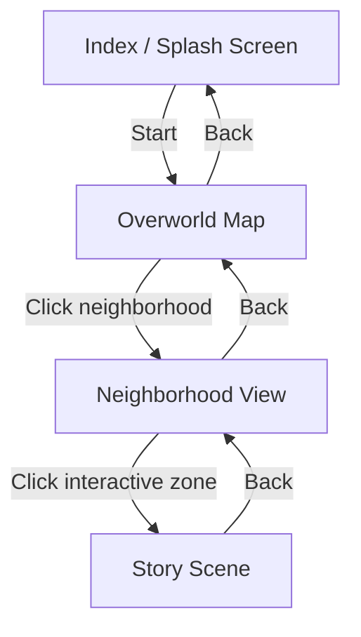

# Anemoia -- MVP Architecture Plan

## Current State

The project has a minimal Astro v5 setup with a basic parallax demo (two layers responding to mouse movement). No SCSS, no content collections, no routing, no additional libraries installed. Everything below builds on top of this foundation.

---

## Step 1: Project Foundation

### 1.1 Directory Structure

```
src/
  assets/
    scenes/
      overworld/
        layers/              -- exported PNGs from PSD
        manifest.json        -- auto-generated layer positions
        ambient.mp3
      saint-roch/
        layers/
        manifest.json
        ambient.mp3
      limoilou/
        layers/
        manifest.json
        ambient.mp3
    splash/
      logo.png
  components/
    scene/
      SceneRenderer.astro    -- reads manifest, renders layers
      SceneLayer.astro       -- single positioned layer (img or video)
      InteractiveZone.astro  -- clickable hotspot overlay
      ParallaxContainer.astro -- wraps layers with parallax behavior
    overworld/
      OverworldMap.astro
      NeighborhoodPin.astro
    story/
      StoryReader.astro      -- scrolling text + audio sync
      AudioPlayer.astro      -- audio playback controls
    effects/
      ShaderCanvas.astro     -- p5.js WebGL overlay
      Snowfall.astro         -- atmospheric particle effect
    ui/
      SplashScreen.astro
      Cursor.astro           -- custom cursor
  content/
    config.ts                -- Astro content collections
  data/
    stories/
      la-memoire.md          -- markdown story with frontmatter
    neighborhoods/
      saint-roch.json        -- metadata (name, slug, description, connections)
      limoilou.json
  layouts/
    GameLayout.astro         -- shared layout with ClientRouter + audio context
  pages/
    index.astro              -- splash / menu
    overworld.astro          -- 2D map view
    neighborhood/
      [slug].astro           -- dynamic route per neighborhood
    story/
      [slug].astro           -- dynamic route per story
  styles/
    global.scss
    _variables.scss
    _mixins.scss
    _reset.scss
    _typography.scss
  scripts/
    parallax.ts              -- shared parallax logic (mouse + scroll)
    audio-manager.ts         -- global audio state
    scene-manager.ts         -- scene lifecycle (enter/exit animations)
tools/
  psd-export.mjs             -- Node.js script to parse PSD and generate manifests
```

### 1.2 Naming and Code Conventions

- **Files**: kebab-case for files (`scene-layer.astro`), PascalCase for Astro components (`SceneLayer.astro`)
- **CSS**: BEM with SCSS (`scene__layer`, `scene__layer--interactive`, `scene__layer--video`)
- **JS/TS**: camelCase for variables/functions, PascalCase for types/interfaces, `UPPER_SNAKE` for constants
- **Assets**: kebab-case, prefixed by scene (`saint-roch-buildings-back.png`)
- **Content collections**: kebab-case slugs matching filesystem

### 1.3 Dependencies to Install

```bash
npm install sass gsap @gsap/shockingly locomotive-scroll p5
```

Note: GSAP's ScrollTrigger plugin is included with the core gsap package. Locomotive Scroll v5 uses Lenis under the hood for smooth scrolling.

### 1.4 Astro Configuration Updates

In [astro.config.mjs](astro.config.mjs):

```js
import {defineConfig} from "astro/config";

export default defineConfig({
	vite: {
		css: {
			preprocessorOptions: {
				scss: {
					additionalData: `@use "src/styles/_variables" as *; @use "src/styles/_mixins" as *;`,
				},
			},
		},
	},
});
```

### 1.5 Content Collections Setup

In `src/content/config.ts`, define two collections:

```typescript
import {defineCollection} from "astro:content";
import {glob, file} from "astro/loaders";
import {z} from "astro/zod";

const stories = defineCollection({
	loader: glob({pattern: "**/*.md", base: "./src/data/stories"}),
	schema: z.object({
		title: z.string(),
		neighborhood: z.string(),
		audioSrc: z.string(),
		order: z.number(),
		duration: z.string().optional(),
	}),
});

const neighborhoods = defineCollection({
	loader: file("src/data/neighborhoods/index.json"),
	schema: z.object({
		id: z.string(),
		name: z.string(),
		slug: z.string(),
		description: z.string().optional(),
		scenePath: z.string(),
		stories: z.array(z.string()),
		position: z.object({x: z.number(), y: z.number()}),
	}),
});

export const collections = {stories, neighborhoods};
```

### 1.6 Shared Layout with View Transitions

In `src/layouts/GameLayout.astro`:

```astro
---
import { ClientRouter } from 'astro:transitions';
---
<html lang="fr">
  <head>
    <meta charset="utf-8" />
    <meta name="viewport" content="width=device-width, initial-scale=1" />
    <title>Anemoia</title>
    <ClientRouter />
  </head>
  <body>
    <slot />
  </body>
</html>
```

The `<ClientRouter />` enables Astro's built-in View Transitions API for smooth animated page-to-page navigation. Elements can use `transition:persist` to maintain state (e.g., audio) across navigations.

---

## Step 2: PSD-to-Web Layer Pipeline

### 2.1 The Problem

Your colleague's Photoshop composition has 12+ layers with precise positions. Re-creating those positions manually in CSS is tedious and error-prone.

### 2.2 Solution: Automated PSD Export Script

Use the `psd` npm package (v3.4.0) to build a Node.js script (`tools/psd-export.mjs`) that:

1. Parses a `.psd` file
2. Extracts each layer's **name**, **bounds** (x, y, width, height), **z-order**, and **visibility**
3. Exports each layer as an individual PNG (Photoshop's "Export Layers to Files" can also do this manually)
4. Generates a `manifest.json` with **percentage-based positions** relative to the canvas

**Percentage conversion formula** (avoids hardcoded pixels, scales responsively):

```
leftPercent  = (layer.left   / canvas.width)  * 100
topPercent   = (layer.top    / canvas.height) * 100
widthPercent = (layer.width  / canvas.width)  * 100
heightPercent= (layer.height / canvas.height) * 100
```

**Example manifest.json output:**

```json
{
	"canvas": {"width": 1920, "height": 1080},
	"layers": [
		{
			"name": "sky",
			"file": "sky.png",
			"zIndex": 0,
			"position": {"left": 0, "top": 0, "width": 100, "height": 45.5},
			"parallaxSpeed": 0.1,
			"interactive": false
		},
		{
			"name": "buildings-back",
			"file": "buildings-back.png",
			"zIndex": 1,
			"position": {"left": 5.2, "top": 30.1, "width": 90, "height": 55},
			"parallaxSpeed": 0.3,
			"interactive": false
		},
		{
			"name": "door-cafe",
			"file": "door-cafe.png",
			"zIndex": 2,
			"position": {"left": 42.1, "top": 55.3, "width": 4.5, "height": 12.2},
			"parallaxSpeed": 0.5,
			"interactive": true,
			"interaction": {
				"type": "navigate",
				"target": "/story/la-memoire",
				"hoverImage": "door-cafe-open.png",
				"cursor": "pointer"
			}
		}
	]
}
```

The `parallaxSpeed` and `interactive`/`interaction` fields are manually added after the initial auto-generation. The script generates the base positioning; you hand-edit the interactivity metadata.

### 2.3 Alternative: Photoshop ExtendScript

If you prefer to keep the workflow inside Photoshop, a `.jsx` ExtendScript can be placed in Photoshop's `Presets/Scripts/` folder. It iterates over `app.activeDocument.layers`, reads each layer's `.bounds` property (array of `[left, top, right, bottom]` in UnitValue), and writes a JSON file. Layer images are exported via "Export Layers to Files" (built-in Photoshop feature). Both approaches produce the same manifest format.

### 2.4 SceneRenderer Component

The core component that reads a manifest and renders all layers:

```astro
---
const { manifest, class: className } = Astro.props;
---
<div class={`scene ${className ?? ''}`}
     style={`aspect-ratio: ${manifest.canvas.width} / ${manifest.canvas.height}`}>
  {manifest.layers.map(layer => (
    <SceneLayer layer={layer} />
  ))}
  <slot />  <!-- for overlay effects like ShaderCanvas -->
</div>
```

Each `SceneLayer` renders as:

```css
.scene__layer {
	position: absolute;
	/* values come from manifest percentages */
	left: var(--layer-left);
	top: var(--layer-top);
	width: var(--layer-width);
	height: var(--layer-height);
	z-index: var(--layer-z);
}
```

The scene container uses `position: relative` and a fixed `aspect-ratio` matching the PSD canvas. All children are absolutely positioned using percentage values from the manifest, so the layout scales naturally.

---

## Step 3: Interactivity and Routing

### 3.1 View/Scene Hierarchy and Routing

```
/                          -> index.astro          (Splash Screen)
/overworld                 -> overworld.astro      (2D Map)
/neighborhood/saint-roch   -> [slug].astro         (Neighborhood View)
/story/la-memoire          -> [slug].astro         (Story Scene)
```

**Dynamic routes** use `getStaticPaths()` to generate pages from content collections:

```astro
---
// src/pages/neighborhood/[slug].astro
import { getCollection } from 'astro:content';

export async function getStaticPaths() {
  const neighborhoods = await getCollection('neighborhoods');
  return neighborhoods.map(n => ({
    params: { slug: n.data.slug },
    props: { neighborhood: n.data },
  }));
}
---
```

### 3.2 Interactive Zones

Interactive zones are defined in the manifest and rendered as overlay elements on top of their parent layer. Two types:

- **Navigation zones**: clicking navigates to another view (e.g., door -> story)
- **State zones**: clicking/hovering toggles a visual state (e.g., window light on/off)

The `InteractiveZone` component:

```astro
<a href={zone.interaction.target}
   class="scene__zone"
   data-zone-type={zone.interaction.type}
   style={`left:${zone.position.left}%; top:${zone.position.top}%; width:${zone.position.width}%; height:${zone.position.height}%`}>
  <!-- hover state image swap handled via CSS or JS -->
</a>
```

For hover image swaps (e.g., closed door -> open door), use CSS:

```scss
.scene__zone {
	&--navigate {
		.scene__zone-hover {
			opacity: 0;
			transition: opacity 0.3s;
		}
		&:hover .scene__zone-hover {
			opacity: 1;
		}
	}
}
```

For more complex effects (window light glow), a small canvas shader can be triggered on hover (see Step 4).

### 3.3 View Transitions

Astro's `<ClientRouter />` (already in the layout) handles animated transitions between views. Customize per-route:

- **Splash -> Overworld**: fade transition
- **Overworld -> Neighborhood**: zoom/slide transition (camera zooming into the clicked area)
- **Neighborhood -> Story**: cinematic fade-to-black

Use `transition:animate` on elements and `transition:name` to pair elements across pages for morphing effects:

```html
<div transition:name="{`neighborhood-${slug}`}" transition:animate="slide"></div>
```

Audio elements use `transition:persist` so music doesn't restart between navigations.

### 3.4 Navigation Flow Diagram



---

## Step 4: Effects, Animations, and Post-Processing

### 4.1 Parallax System (GSAP)

Replace the current vanilla JS parallax with GSAP for more control. Two modes:

- **Mouse parallax** (neighborhood view): layers shift based on cursor position, speed determined by `parallaxSpeed` in the manifest
- **Scroll parallax** (story view): layers shift on scroll using GSAP ScrollTrigger

```javascript
import gsap from "gsap";

function initMouseParallax(layers) {
	document.addEventListener("mousemove", (e) => {
		const xPercent = (e.clientX / window.innerWidth - 0.5) * 2;
		const yPercent = (e.clientY / window.innerHeight - 0.5) * 2;
		layers.forEach((layer) => {
			gsap.to(layer.element, {
				x: xPercent * layer.speed * 50,
				y: yPercent * layer.speed * 50,
				duration: 0.6,
				ease: "power2.out",
			});
		});
	});
}
```

### 4.2 Story View -- Locomotive Scroll v5 + GSAP

The story scene (Lost Odyssey-inspired) uses Locomotive Scroll v5 for buttery smooth scrolling combined with GSAP ScrollTrigger for text/image reveal animations:

- Locomotive Scroll v5 uses **Lenis** under the hood for smooth scrolling
- Parallax on story background elements via `data-scroll-speed` attributes
- GSAP ScrollTrigger for text fade-in, background transitions, and audio sync checkpoints

```javascript
import LocomotiveScroll from "locomotive-scroll";

const scroll = new LocomotiveScroll({
	lenisOptions: {lerp: 0.08, smoothWheel: true},
});
```

Combine with GSAP ScrollTrigger by using Locomotive's scroll events to update ScrollTrigger:

```javascript
import {ScrollTrigger} from "gsap/ScrollTrigger";
gsap.registerPlugin(ScrollTrigger);

scroll.on("scroll", ScrollTrigger.update);
ScrollTrigger.scrollerProxy(document.documentElement, {
	scrollTop(value) {
		return arguments.length ? scroll.scrollTo(value, {duration: 0, disableLerp: true}) : scroll.scroll.instance.scroll.y;
	},
	getBoundingClientRect() {
		return {top: 0, left: 0, width: window.innerWidth, height: window.innerHeight};
	},
});
```

### 4.3 Canvas Shader Layer (p5.js)

A `ShaderCanvas` component overlays a transparent p5.js WebGL canvas on top of scene layers for post-processing effects:

- **Atmospheric effects**: snowfall, rain particles, fog
- **Color grading**: vignette, color shifts per scene
- **Interactive feedback**: glow effects on hover zones

Architecture:

```
SceneRenderer
  +-- SceneLayer (z:0, sky)
  +-- SceneLayer (z:1, buildings)
  +-- ShaderCanvas (z:50, transparent overlay, pointer-events: none)
  +-- SceneLayer (z:99, foreground snow)
  +-- InteractiveZone (z:100, pointer-events: auto)
```

The p5.js sketch runs in instance mode to avoid global namespace pollution:

```javascript
import p5 from "p5";

new p5((sketch) => {
	let shader;
	sketch.setup = () => {
		const canvas = sketch.createCanvas(window.innerWidth, window.innerHeight, sketch.WEBGL);
		canvas.parent("shader-container");
		shader = sketch.createShader(vertSrc, fragSrc);
	};
	sketch.draw = () => {
		sketch.shader(shader);
		shader.setUniform("u_time", sketch.millis() / 1000.0);
		shader.setUniform("u_mouse", [sketch.mouseX / sketch.width, sketch.mouseY / sketch.height]);
		sketch.rect(0, 0, sketch.width, sketch.height);
	};
}, document.getElementById("shader-container"));
```

For simpler particle effects (snow, rain), p5.js 2D mode is sufficient and less GPU-intensive. Reserve WebGL mode for actual shader post-processing.

### 4.4 Audio Management

A global audio manager persisted across navigations via `transition:persist`:

- Each scene defines ambient audio in its manifest
- Story scenes have synced voiceover audio
- Crossfade between ambient tracks on scene transitions
- The `AudioPlayer` component handles play/pause UI

### 4.5 Video Loops

Some layers in the manifest are video loops instead of static images. The `SceneLayer` component handles both:

```astro
{layer.type === 'video'
  ? <video src={layer.file} autoplay loop muted playsinline class="scene__layer" />
  : 
}
```

Videos use `transition:persist` to avoid restarting during navigation.

---

## MVP Scope (2-Week Residency)

Given the time constraint, prioritize in this order:

1. **Week 1**: Steps 1 + 2 -- project structure, PSD pipeline, one neighborhood rendered with layers positioned from manifest, basic parallax
2. **Week 2**: Steps 3 + 4 -- routing between overworld/neighborhood/story, interactive zones, one story scene with Locomotive Scroll, atmospheric snow effect, view transitions

**Defer to post-MVP**: full shader post-processing, complex hover effects (window lights), audio sync, multiple neighborhoods
